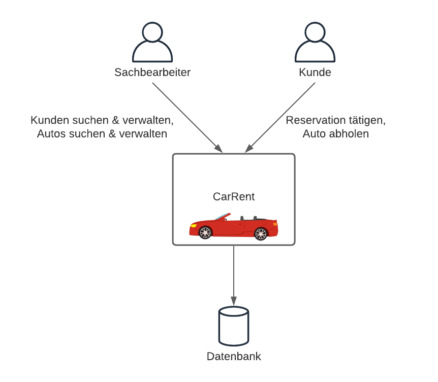
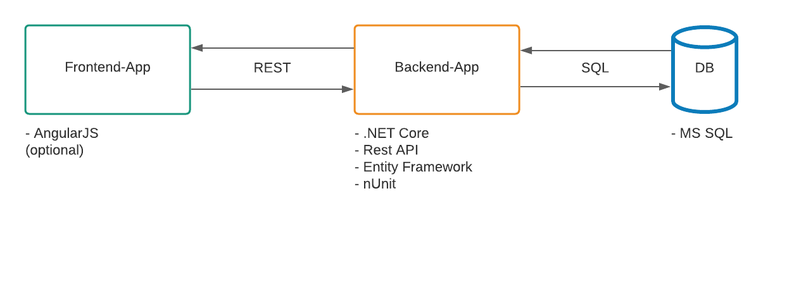
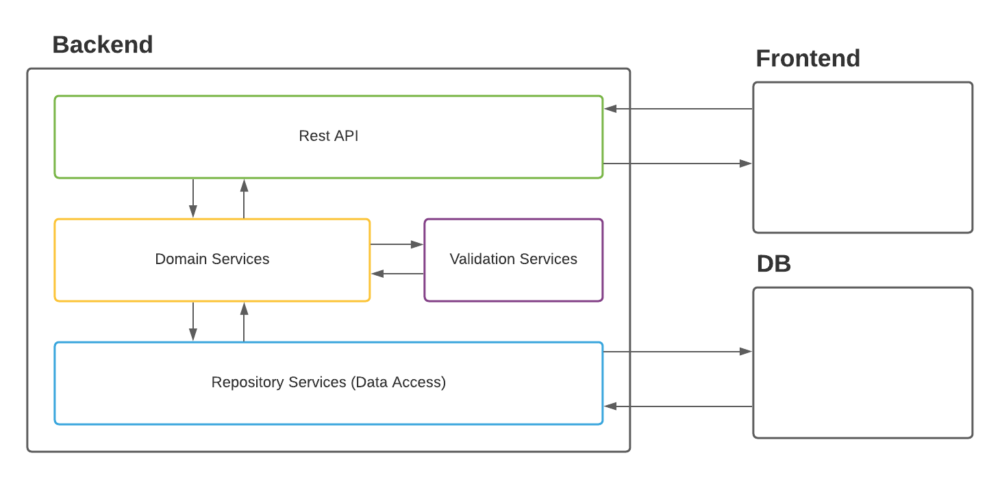

# Arbeitspaket 1 – Big Picture / Vision 

Hilfsmittel: Whiteboard, Flipchart, Postit, Word, UML Tool, Markdown, … 

## Aufgabe

Erstellen Sie mittels C4-Pattern das Big-Picture des Systems. 

### Context 

### Containers 

### Components 

