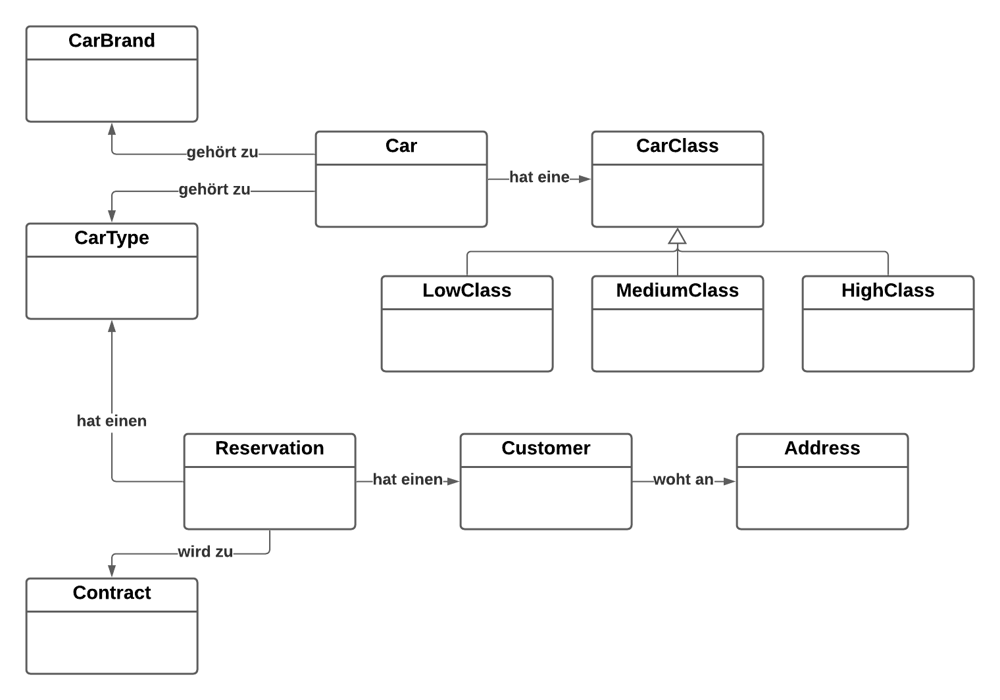

# Arbeitspaket 2 – Domain Model und Use Cases 

Hilfsmittel: UML Tool, Markdown, … 

## Aufgabe 

Erstellen Sie das Domain Model und schreiben Sie die alle Use Cases im „Brief“-Format auf. 

### Domain Model

### Use Cases im "Brief" Format

**1 - Kunden verwalten**

- Der Sachbearbeiter kann:
  - neue Kunden erfassen
  - bestehende Kunden bearbeiten
  - alte Kunden löschen / deaktivieren
  - nach Kunden suchen

**2 - Autos verwalten**

- Der Sachbearbeiter kann:
  - neue Autos erfassen
  - Autos bearbeiten
  - alte / verkaufte Autos deaktivieren
  - nach Autos suchen

**3 - Kunde erstelt Reservation**

- der Kunde sucht nach einem Auto
- dabei kann er nach der Klasse filtern
- anschliessend gibt er das Start- und Enddatum der Reservation an
- er erhält die Gesamtkosten der Reservation
- die Reservation wird gespeichert

**4 - Kunde holt Auto ab**

- Am Startdatum kommt der Kunde in die Garage und der Sachbearbeiter klickt bei der entsprechenden Reservation:
  - Mietvertrag generieren
  - Dieser Button wandelt die Reservation in einen Mietvertrag um.
    - Das Reservationsmodel hat ein Flag "Mietvertrag".
    - Dieses wird just in diesem Moment auf true gesetzt.
  - Der Kunde unterzeichnet den Vertrag und kann das Auto mitnehmen.